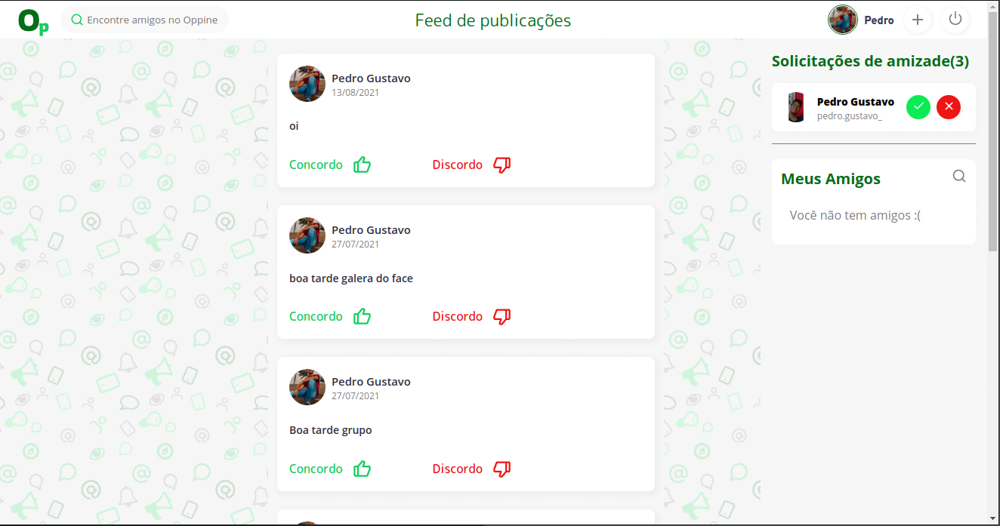
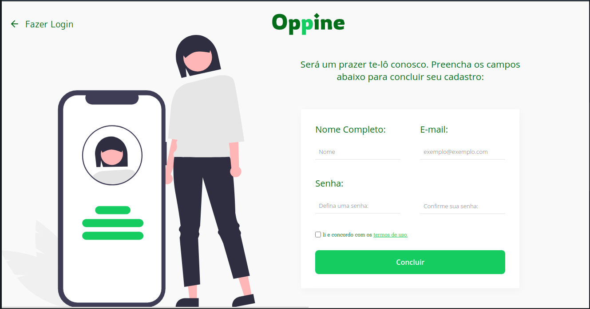
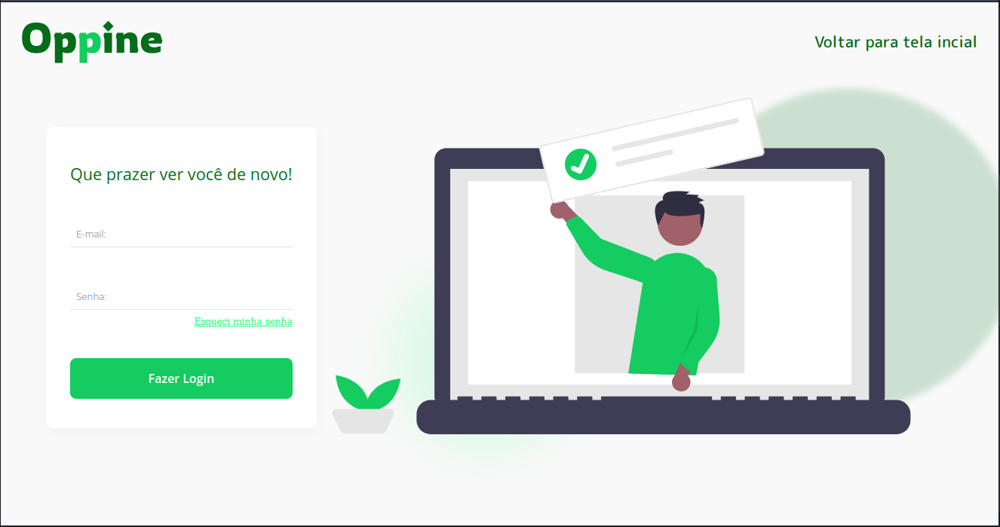

  

<h2 align="center">Uma rede social como qualquer outra só que minha :) </h2>
<h3 align="center">🚧Em desenvolvimento🚧</h3>

# 📝 Índice de conteúdos

- [Sobre o projeto](#about)
- [Iniciando o projeto ](#getting_started)
- [Ferramentas utilizadas](#built_using)
- [Autores](#authors)

 

# 🧐 Sobre o projeto 

<h3>Este projeto foi desenvolvido no intúito de treinar alguns conceitos utilizados no desenvolvimento web (front-end e back end) além de servir para agregar no porifólio.</h3>

 

 

# 🏁 Iniciando o projeto 

 

Caso queira baixar o projeto em sua máquina e testá-lo, basta copiar o repositório localmente, em seguida, rode o seguinte comando:

    npm start
    ou
    yarn

 

## ⛏️  Ferramentas utilizadas 

- [PostgreSQL](https://www.postgresql.org) - Database
- [Express](https://expressjs.com/) - Framework para o servidor
- [ReactJs](https://reactjs.org) - Framework Web
- [NodeJs](https://nodejs.org/en/) - Ambiente do servidor
- [Docker](https://www.docker.com) - Criação de Container para o banco de dados

 

## ✍️ Idealizado por: 

 

- [@PedroGustav](https://github.com/PedroGustav)

 
 

# 📸 Algumas Imagens do projeto 

 

  
  
Tela principal da aplicação

 

 

 

 

  
  
Tela de cadastro

 

 

 

 

  
  
Tela de Login

 

 

 

 

 

 

### 
Críticas e sugestões são sempre bem vindas para um desenvolvedor em desenvolvimento :)

